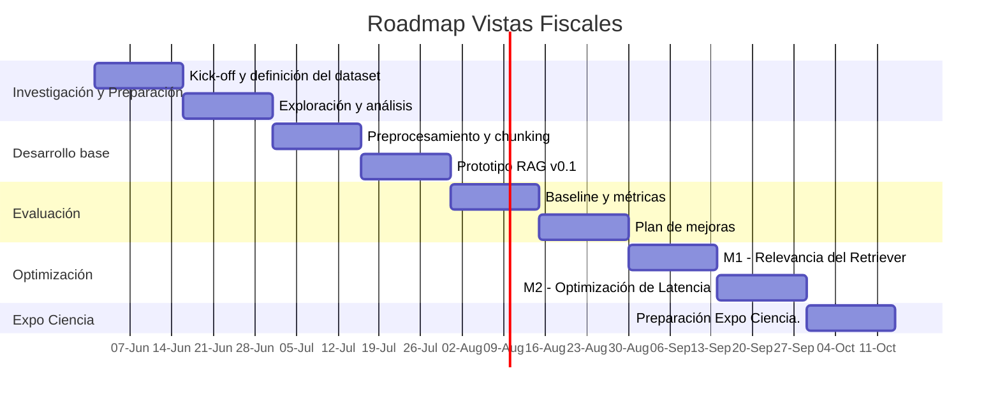

# Plan de Trabajo - Grupo nro 2

## Tema

Vistas Fiscales

## Integrantes del grupo
- Victor Manuel Montini
- Pablo Redruello
- Nicolás Ezequiel Ricciardi
- Leandro Yalet

## Cronograma

### Investigación y Preparación
#### Kick-off y definición del dataset

Durante esta etapa se formalizará el alcance del proyecto, se validará el acceso a la infraestructura provista (VPN y hardware), y se realizará un relevamiento inicial de las vistas fiscales disponibles para el prototipo.

Objetivos:

- Comprender el dominio de negocio y los criterios jurídicos contenidos en las vistas fiscales
- Identificar restricciones técnicas y de seguridad
- Confirmar disponibilidad y características del dataset
- Definir casos de uso iniciales y consultas representativas

Entregables:

- Documento de alcance
- Inventario preliminar del dataset
- Identificación de riesgos iniciales

#### Exploración y análisis

Se realizará un análisis exploratorio de los documentos para comprender su estructura, calidad, volumen y potenciales fuentes de metadata.

Objetivos:

- Analizar formatos y estructura documental
- Identificar campos de metadata potenciales
- Detectar problemas de calidad de datos
- Definir estrategias preliminares de procesamiento

Entregables:

- Informe exploratorio
- Catálogo preliminar de metadata
- Recomendaciones para el pipeline de procesamiento

### Desarrollo Base

#### Preprocesamiento y chunking

Implementación del pipeline inicial de procesamiento documental para transformar las vistas fiscales en información utilizable por el sistema RAG.

Objetivos:

- Normalizar documentos
- Implementar limpieza de texto
- Diseñar estrategia de chunking
- Generar embeddings iniciales
- Preparar la indexación documental

Entregables:

- Pipeline reproducible
- Dataset procesado
- Índice vectorial inicial

#### Prototipo RAG v0.1

Construcción de la primera versión funcional del sistema de recuperación y generación de respuestas.

Objetivos:

- Implementar el retriever
- Integrar el modelo generativo
- Construir el flujo completo de consulta
- Validar funcionamiento extremo a extremo

Entregables:

- Prototipo funcional
- API o interfaz de prueba
- Documentación técnica inicial

### Evaluación

#### Baseline y métricas

Definición del punto de partida para medir la evolución del sistema.

Objetivos:

- Construir el dataset de validación
- Definir métricas de recuperación y generación
- Implementar la suite automatizada de evaluación
- Obtener resultados de referencia

Framework de evaluación:

- RAGAS

Tests planificados:

- test_latencia
- test_precision_retriever
- test_ragas_faithfulness
- test_ragas_answer_relevancy
- test_regresion

Entregables:

- Baseline documentado
- Resultados iniciales
- Dataset de evaluación

### Plan de mejoras

A partir de los resultados obtenidos en el baseline se seleccionarán las optimizaciones prioritarias.

Objetivos:

- Analizar cuellos de botella
- Priorizar mejoras según impacto esperado
- Definir métricas objetivo
- Elaborar plan de experimentación

Criterio de éxito:

Una mejora se considera exitosa si mejora la métrica objetivo al menos un 10% sin degradar otras métricas más de un 5%.

Entregables:

- Documento plan de mejoras
- Métricas objetivo por mejora

### Optimización

#### M1 – Relevancia del Retriever

Optimización del mecanismo de recuperación para aumentar la pertinencia de los documentos recuperados.

Posibles técnicas:

- Re-ranking
- Hybrid Search
- BM25 + embeddings
- MMR
- HyDE

Métricas objetivo:

- Precision@k
- MRR
- NDCG

Entregables:

- Retriever optimizado.
- Comparativa contra baseline.

#### M2 – Optimización de Latencia

Reducción de los tiempos de respuesta del sistema sin comprometer la calidad de las respuestas.

Posibles técnicas:

- Caché semántico
- Optimización de índices
- Cuantización de modelos
- Ajustes de infraestructura local

Métricas objetivo:

- Latencia P50.
- Latencia P95.

Entregables:

- Versión optimizada.
- Reporte comparativo de rendimiento.
- Expo Ciencia

### Preparación Expo Ciencia

Preparación del material de divulgación y demostración del proyecto.
